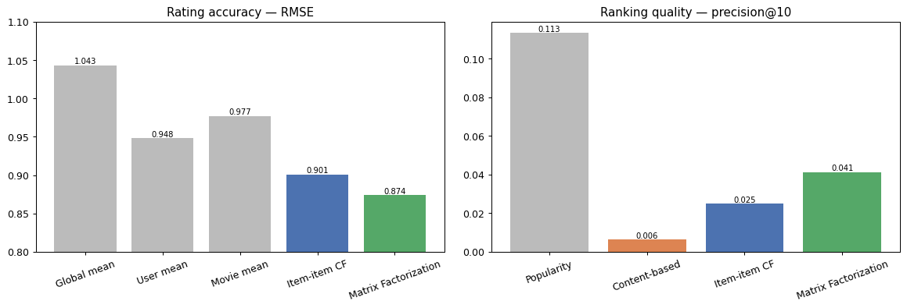

# 🎥 Movie Recommendation System (Collaborative Filtering)


Recommend movies from the **MovieLens** dataset, building up from simple
baselines to collaborative filtering — item-item similarity and a
**from-scratch matrix factorization (funkSVD)** — plus a content-based option.
Evaluated on both rating accuracy (RMSE) **and** ranking quality (precision@k).

---

## 🔎 Results

| | Rating accuracy | Ranking |
|---|---|---|
| | RMSE (lower better) | precision@10 (higher better) |
| Global mean | 1.043 | — |
| User mean | 0.948 | — |
| Movie mean | 0.977 | — |
| Popularity | — | **0.113** |
| Content-based | — | 0.006 |
| Item-item CF | 0.901 | 0.025 |
| **Matrix Factorization** | **0.874** | 0.041 |



**Two takeaways worth the space:**
1. **Matrix factorization wins on RMSE** — learned latent factors generalize
   across the ~98% sparsity better than similarity or averages.
2. **A plain popularity baseline wins on precision@10.** This is *popularity
   bias* — the test set skews toward popular movies, so recommending popular
   films scores well offline. The model that predicts *ratings* best isn't
   automatically the best *ranker*, and popularity is a famously hard offline
   baseline. Surfacing this is central to honest recommender work.

---

## ✨ Highlights

- **Per-user train/test split** so every user has history + held-out ratings.
- **Item-item CF** — adjusted-cosine similarity (centered by user mean),
  top-K neighbor prediction, cold-item fallback.
- **Matrix factorization from scratch** — bias-aware funkSVD
  (`mu + b_u + b_i + p_u·q_i`) trained by SGD, no external recommender library.
- **Content-based** genre recommender (helps the long-tail / cold-start).
- **Dual evaluation** — RMSE for accuracy, precision@k / recall@k for ranking.

---

## 📁 Project structure
```
movie-recommender/
├── movie_recommender.ipynb   # full walkthrough notebook (start here)
├── src/
│   ├── data_prep.py          # per-user split + sparse user-item matrix
│   ├── memory_cf.py          # baselines + item-item CF
│   ├── mf.py                 # matrix factorization (funkSVD, from scratch)
│   ├── content_based.py      # genre-based recommender
│   ├── evaluate.py           # RMSE + precision@k comparison
│   └── recommend.py          # top-N recommendations for a user
├── data/                     # ratings.csv + movies.csv (committed, ~2.9 MB)
├── assets/                   # charts for this README
├── requirements.txt
├── LICENSE
└── README.md
```

---

## 🚀 Quickstart
```bash
python -m venv .venv && source .venv/bin/activate
pip install -r requirements.txt

# Run the walkthrough:
jupyter notebook movie_recommender.ipynb
```

Or run the pipeline as scripts:
```bash
python -m src.data_prep      # split + build matrix
python -m src.memory_cf      # baselines + item-item CF
python -m src.mf             # matrix factorization
python -m src.evaluate       # RMSE + precision@k comparison
python -m src.recommend --user 1 --n 10   # recommend for a user
```

---

## 📊 Dataset
**MovieLens (ml-latest-small)** — 100,836 ratings, 610 users, 9,724 movies
(~98.3% sparse). Committed to the repo. See [`data/README.md`](data/README.md).

## 🗺️ Roadmap
- [ ] Optimize directly for ranking (BPR / implicit feedback)
- [ ] Hybrid model blending collaborative + content signals (cold-start)
- [ ] `recommend(user)` API behind a small web UI

## 📄 License
MIT. Dataset retains its original license (GroupLens).
